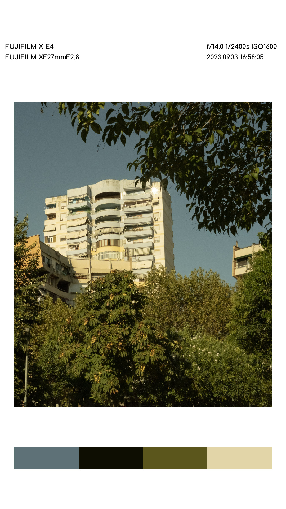
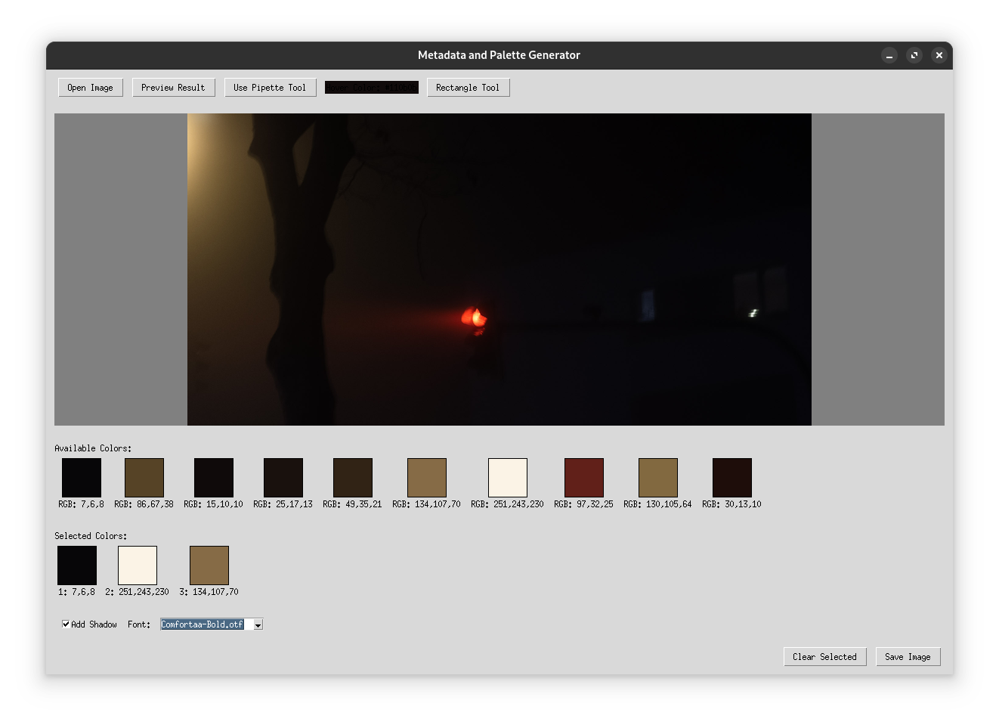
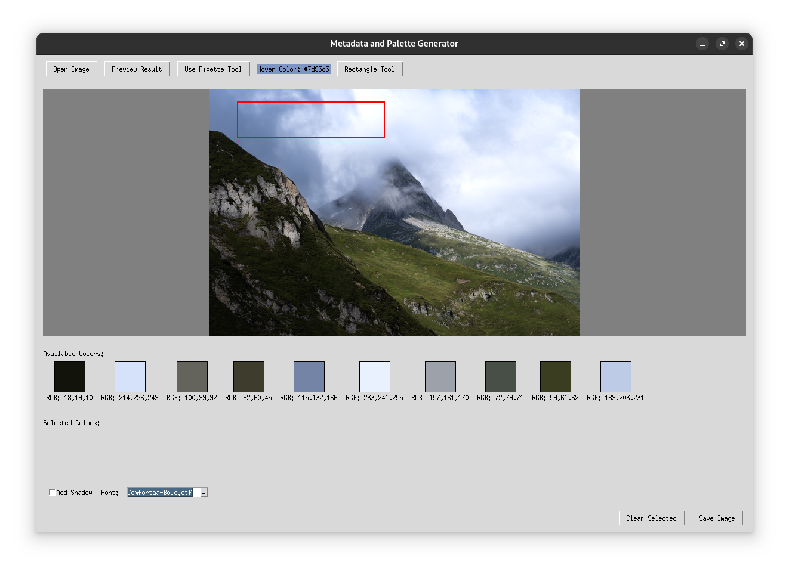

# ColorStamp

<p align="center">

</p>

A simple Python tool that creates aesthetically pleasing image compositions with color palettes and metadata - inspired by this [Reddit post](https://www.reddit.com/r/AskPhotography/comments/1em9lxx/where_do_we_export_image_with_metadata_like_this/).

**Disclaimer**: This project is tailored for my own purpose: creating Instagram stories from my photographs. That's why the format is fixed to portrait/phone aspect ratio and the resolution is only Full HD.

I began with a very small script that did everything automatically, but I found that it sometimes did not pick up colors that were very important for the picture but were just not among the main colors (the red light in Figure 1 for example). Therefore, I created a GUI that allows users to manually pick additional colors beyond the automatic selection.


*Figure 1: The prominent red light is not shown in the palette but it would be beautiful to have it.*


*Figure 2: The rectangle tool lets us average colors from an area. With the pipette we pick very precise colors.*

## Features

- **Extract Color Palettes**: Automatically generates color palettes from images using Gaussian Mixture Models.
- **Custom Color Selection**: Add colors manually using pipette and rectangle tools. 
- **Color Averaging**: The Gaussian Mixture Model calculates the average color of each cluster. Clusters can therefore get 'dirty' if they include too many different colors.
- **Metadata Extraction**: Pulls EXIF data from images including camera model, lens info, aperture, shutter speed, ISO, and date/time.
- **Instagram-Ready Compositions**: Creates 9:16 aspect ratio compositions perfect for Instagram Stories.
- **Shadow Effects**: Optional drop shadow effect for a more polished look (helps to highlight light-colored pictures).
- **Custom Font Support**: Use your system fonts for personalized compositions.
- **Preview Before Saving**: View the final composition before saving.

## Installation

### Prerequisites

ColorStamp requires Python 3.6+ and the following packages:
- Pillow (PIL)
- OpenCV (cv2)
- NumPy
- scikit-learn
- exifread
- matplotlib
- tkinter (usually comes with Python)

### Install Dependencies

```bash
pip install pillow opencv-python numpy scikit-learn exifread matplotlib
```

### Run the Application

```bash
python ColorStamp.py
```

## Usage

 ⚠️ **Attention: The metadata printout only works with photos that have EXIF metadata baked in. In Lightroom this was off by default for me. In order to enable it click share and then the gear next to download toggle *Apply content cridentials* to export metadata with your .jpgs**


1. **Open an Image**: Click "Open Image" to select an image file (JPEG, PNG, TIFF, etc.)
2. **Extract Colors**: The application automatically extracts dominant colors using Gaussian Mixture Models
3. **Select Colors**: 
   - Click on colors in the palette to add them to your selection
   - Use the Pipette Tool to pick specific colors from the image
   - Use the Rectangle Tool to select regions and capture their average color
4. **Customize Options**:
   - Enable/disable shadow effect
   - Select a font for text elements
5. **Preview Result**: Click "Preview Result" to see how the final composition will look
6. **Save Image**: Click "Save Image" to export your composition as a JPEG or PNG file

 **Some fonts do render very different. For me most fonts work well, but I've noticed some may look weird.**